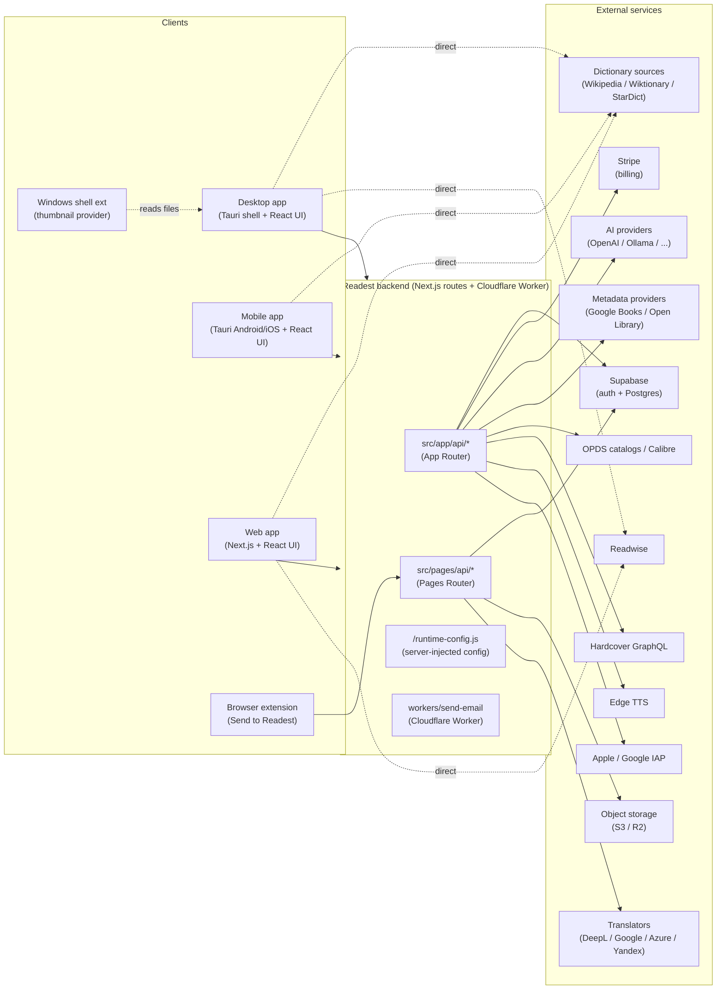
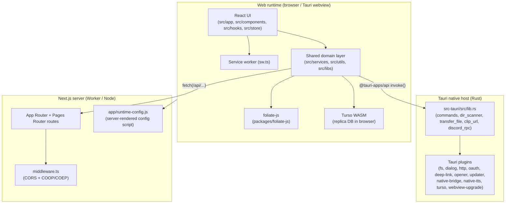
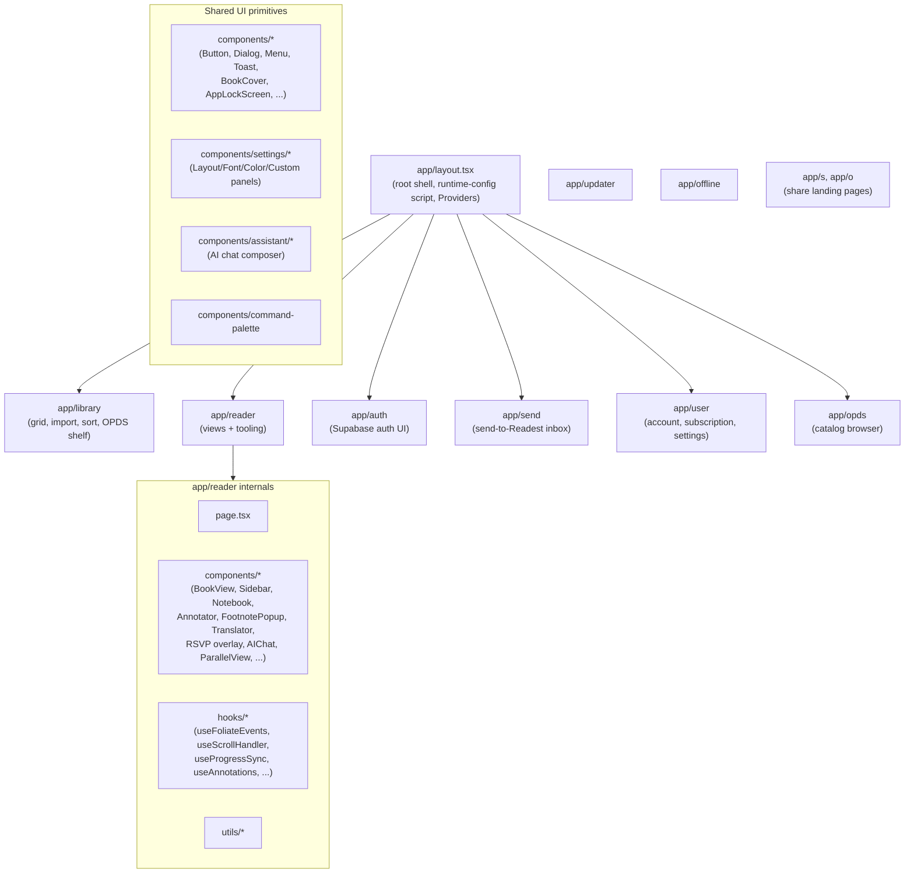
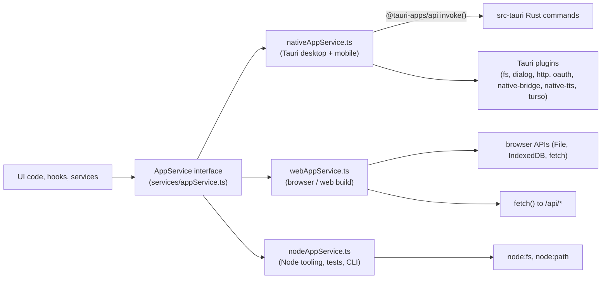
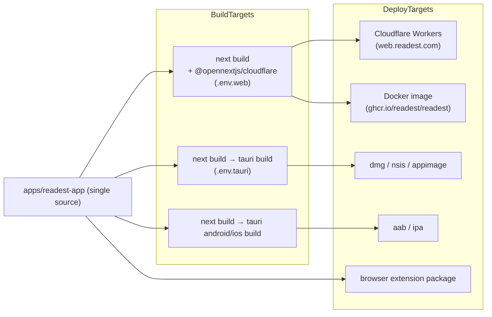

# Readest Architecture

This document gives a system-level view of Readest: how the pieces fit together,
which side of the wire each piece runs on, and what each module is responsible
for. It complements [`code-layout.md`](./code-layout.md), which focuses on the
directory layout. Read this one first if you want to understand the system; read
that one when you need to find a specific file.

The diagrams use [Mermaid](https://mermaid.js.org/) and render natively on
GitHub.

## 1. High-level picture

Readest is a single TypeScript/React codebase (`apps/readest-app`) compiled into
multiple targets:

- a **desktop app** (Windows / macOS / Linux) via Tauri v2
- a **mobile app** (Android / iOS) via Tauri v2 mobile
- a **web app** running on Next.js / Cloudflare Workers (OpenNext) at
  [web.readest.com](https://web.readest.com)
- two **side surfaces**: a "Send to Readest" browser extension
  (`apps/readest-app/extension/send-to-readest`) and a Windows thumbnail
  shell extension (`apps/readest-app/extensions/windows-thumbnail`)

The same React UI runs in all targets. What differs is the **host shell** under
the UI and the **set of services** that the UI binds to at runtime — see
section 4.



The `Backend` box is **the same code on all clients**. In the web target it is
deployed as a Cloudflare Worker (via `@opennextjs/cloudflare` and
`wrangler.toml`). In the Tauri targets the same routes are served by a Next.js
runtime, but most clients hit the production deployment over HTTPS.

## 2. Process boundaries

There are three runtimes in play:



Three things are worth calling out:

The same `src/services/*` code runs on both sides of the `invoke()` boundary on
desktop/mobile and on both sides of the `fetch()` boundary on web. Which
implementation is picked is decided at runtime by `src/services/environment.ts`
plus the platform-specific `*AppService.ts` (`webAppService`, `nativeAppService`,
`nodeAppService`) — see section 4.

`middleware.ts` does two things and only two things: CORS for `/api/*`, and
`Cross-Origin-Opener-Policy: same-origin` + `Cross-Origin-Embedder-Policy:
require-corp` on every document. The COOP/COEP pair is required so that the
browser exposes `SharedArrayBuffer`, which the Turso WASM thread pool needs in
order to run the in-browser replica database; without those headers
`initThreadPool` hangs.

`/runtime-config.js` is a server route that emits
`window.__READEST_RUNTIME_CONFIG = {...}` as a JavaScript file. It is loaded as
a `<script>` tag from `app/layout.tsx` and `pages/_document.tsx`. This is what
lets a single Docker image be rebranded with a different Supabase project, S3
endpoint, or quota at deploy time without rebuilding — see commit
`9ad43aa8` and the `docker/` directory.

## 3. Frontend architecture

The frontend is a Next.js 16 + React 19 app. It uses both routers:

| Concern | Lives in | Why |
|---|---|---|
| Library, reader, auth, OPDS, send, user pages | `src/app/*` (App Router) | Standard for new pages; supports server components and the runtime-config route. |
| Reader entry by ID list `/reader/[ids]` | `src/pages/reader/[ids].tsx` (Pages Router) | Historical entrypoint; coexists with the App Router reader. |
| Cross-origin isolation document shell | `src/pages/_document.tsx` | Pages Router still owns `<Document>` for COOP/COEP and `runtime-config.js`. |
| HTTP API endpoints | both `src/app/api/*` and `src/pages/api/*` | Mix of new App Router routes and legacy Pages Router routes. |

### 3.1 UI module map



The biggest UI cluster by far is `app/reader`: roughly 80 components and 30
hooks coordinating Foliate-based rendering, annotations, footnote popovers, the
notebook side panel, parallel view, RSVP, AI chat, translator overlays,
search, TTS, and the settings panels under `components/settings`.

### 3.2 State (Zustand)

Frontend state is split across single-purpose Zustand stores in `src/store`.
Each store maps to a clearly delimited concern, which keeps the reader from
collapsing into one mega-context:

```
libraryStore        -> books, folders, selection, sort
bookDataStore       -> per-book data (TOC, annotations, locations)
readerStore         -> active views, layout, ribbon state
parallelViewStore   -> two-pane reading
notebookStore       -> notebook side panel
settingsStore       -> user/app settings
themeStore          -> light/dark/atmosphere
sidebarStore        -> sidebar visibility/width
trafficLightStore   -> macOS traffic-light positioning
appLockStore        -> app PIN lock
deviceStore         -> device profile
transferStore       -> in-flight uploads/downloads
aiChatStore         -> AI chat sessions
proofreadStore      -> proofread side flow
atmosphereStore     -> ambient overlay
customDictionaryStore / customFontStore /
  customTextureStore / customOPDSStore       -> user-imported assets
```

### 3.3 In-browser book engine

EPUB / MOBI / KF8 / FB2 / CBZ / TXT / PDF parsing and rendering is **not**
hand-rolled in this repo. The reader sits on top of `packages/foliate-js`, a
forked copy of the Foliate JS engine. Readest's reader code in `app/reader` and
the adapters under `src/services/annotation`, `src/services/nav`,
`src/services/transformers`, and `src/services/rsvp` wrap that engine and add
features (annotations sync, navigation, content transforms, vertical/Warichu
support, classic mode overlays, etc.).

PDF rendering goes through `pdfjs-dist`, which is copied into
`public/vendor/pdfjs` at build time (`pnpm setup-pdfjs`). Chinese conversion
uses `simplecc-wasm` (`public/vendor/simplecc`), and Chinese segmentation uses
`jieba-wasm` (`public/vendor/jieba`).

### 3.4 Service worker and offline

`src/sw.ts` is a Serwist service worker that gives the web build offline
support: cached static assets, cached API responses for read-only data, and an
offline route at `/offline`.

## 4. The platform abstraction (`AppService`)

The single most important abstraction in the codebase is
`src/services/appService.ts`. Every piece of code that touches "the platform"
(file system, native dialogs, shell open, native TTS, IAP, dir scanning,
deep links, etc.) goes through an `AppService` interface. There are three
implementations:



`environment.ts` decides at runtime which implementation to mount, based on the
build target (`NEXT_PUBLIC_APP_PLATFORM`) and runtime detection (`window`,
Tauri injection). Most callers in the codebase do
`const appService = useEnv().appService` and never know which one they got.

The same pattern repeats for the database layer in `src/services/database`:
`webDatabaseService` (browser via Turso WASM), `nativeDatabaseService` (Tauri
via the `tauri-plugin-turso` plugin), and `nodeDatabaseService` (Node, used by
tests). All three share `migrate.ts` and `migrations/*`.

This is why most domain code in `src/services` looks platform-agnostic — the
platform difference has been pushed to a small number of seams.

## 5. Backend (Next.js routes)

There are two route trees because of historical mix between App Router and
Pages Router. The split is pragmatic, not load-bearing: new routes go to
`src/app/api`, legacy/sync/storage live in `src/pages/api`.

### 5.1 Pages Router endpoints (`src/pages/api`)

These are the long-standing server endpoints around sync, storage, and email:

```
sync.ts                  -> KOReader-compatible sync client (`KOSyncClient`)
kosync.ts                -> KOSync legacy bridge
sync/replicas.ts         -> replica sync upload/download (encrypted blobs)
sync/replica-keys.ts     -> replica key bootstrap
storage/upload.ts        -> presigned upload to S3/R2 for book bytes
storage/download.ts      -> presigned download
storage/list.ts          -> list user's objects
storage/delete.ts        -> delete a single object
storage/purge.ts         -> bulk wipe (account deletion path)
storage/stats.ts         -> per-user usage/quotas
send/inbox.ts            -> "Send to Readest" inbox listing
send/inbox/*             -> inbox item operations
send/address.ts          -> per-user inbox address resolver
send/fetch-url.ts        -> server-side URL fetcher for "send a link"
send/senders.ts          -> sender allowlist
deepl/translate.ts       -> DeepL translation proxy (hides API key)
user/delete.ts           -> account deletion
```

The storage layer talks to S3-compatible storage through `src/utils/s3.ts`,
which honors a `S3_PUBLIC_ENDPOINT` distinct from the internal endpoint so
docker-compose deployments can route browsers through one origin and the
server through another.

### 5.2 App Router endpoints (`src/app/api`)

Newer endpoints, grouped by domain:

```
ai/chat                  -> streaming AI chat (Vercel AI SDK)
ai/embed                 -> embeddings for in-book RAG
metadata/search          -> metadata lookup (Google Books / Open Library)
opds/proxy               -> CORS-friendly OPDS proxy
tts/edge                 -> Edge TTS streaming
hardcover/graphql        -> Hardcover GraphQL relay
stripe/checkout          -> create checkout session
stripe/portal            -> billing portal redirect
stripe/plans             -> plan listing
stripe/check             -> subscription state
stripe/webhook           -> Stripe webhook handler
google/iap-verify        -> Google Play IAP verification
apple/iap-verify         -> App Store IAP verification
share/*                  -> share-link landing + read-only render
```

### 5.3 Workers

`apps/readest-app/workers/send-email` is a separate Cloudflare Worker
(deployed independently from the main app) responsible for the "Send to Readest
by email" path. It receives mail, normalizes attachments, and drops items into
the user's inbox so that the in-app `Send` page can pick them up via the
`/api/send/inbox` endpoints.

### 5.4 Runtime config

`src/app/runtime-config.js/route.ts` is a server route that builds a small JSON
object — `supabaseUrl`, `supabaseAnonKey`, `apiBaseUrl`, `objectStorageType`,
`storageFixedQuota`, `translationFixedQuota` — from `process.env` at request
time and serializes it as a JS payload. The client reads it through
`getRuntimeConfig()` in `src/services/runtimeConfig.ts` (browser) or
`getServerRuntimeConfig()` (server). This is the mechanism that makes the same
prebuilt Docker image rebrandable per deployment.

## 6. Cross-cutting subsystems

These don't live in one file or one route; they span the frontend, the backend,
and (sometimes) the native shell.

### 6.1 Sync

Two sync paths coexist:

The first is **legacy KOReader-compatible sync** for reading progress,
implemented by `src/services/sync/KOSyncClient.ts` against `pages/api/sync.ts`
and `pages/api/kosync.ts`. It exists for compatibility with KOSync-style
clients.

The second is **replica sync**, the modern path. It encrypts each replica
locally with a passphrase-derived key
(`replicaCryptoMiddleware.ts`, `passphraseGate.ts`), publishes deltas to
`pages/api/sync/replicas.ts`, pulls peer updates, and applies them through
category adapters in `src/services/sync/adapters/*` (annotations, settings,
dictionaries, fonts, textures, OPDS catalogs). The orchestrator is
`replicaSyncManager.ts`. A cursor store (`replicaCursorStore.ts`) tracks "where
I last pulled to" per category so syncs are incremental.

### 6.2 Cloud library

Distinct from replica sync. The cloud library handles **book bytes** (not
metadata):

- import flow: `src/services/ingestService.ts` decides whether a book is
  imported as a hash copy under `Books/<hash>/` or kept *in place* at the
  user's chosen path (the "in-place" mode added in commit `dd107277`).
- upload: `cloudService.uploadBook` uses the storage layer to push bytes to S3
  through `pages/api/storage/upload.ts`.
- download: peers fetch via `pages/api/storage/download.ts`, materializing the
  book into `Books/<hash>/` regardless of whether the original device kept it
  in-place.
- delete: symmetric local/cloud/both semantics in `cloudService.deleteBook`.

### 6.3 AI / RAG

`src/services/ai` provides the chat and embedding abstraction with provider
adapters, prompt assembly, chunking, retry, and a local AI store. UI lives in
`components/assistant` and the reader-side `app/reader/components/AIChat*`. The
HTTP entrypoints are `src/app/api/ai/chat` (streaming) and
`src/app/api/ai/embed`. The reader can do book-scoped RAG by embedding chapters
locally and querying the embeddings store.

### 6.4 Translation

`src/services/translators` has provider adapters for DeepL, Google, Azure, and
Yandex, plus a preprocess + cache + polish pipeline. DeepL goes through a
server proxy (`pages/api/deepl/translate.ts`) to keep the API key server-side;
the others can hit the providers directly from the client.

### 6.5 TTS

Three TTS backends behind one interface (`src/services/tts`):

- `WebSpeechClient` for browsers,
- `NativeTTSClient` for Tauri via `tauri-plugin-native-tts`,
- `EdgeTTSClient` going through `src/app/api/tts/edge` for streaming Microsoft
  Edge voices.

### 6.6 Dictionaries

`src/services/dictionaries` parses StarDict and SLOB packs locally
(`readers/`), and integrates online sources (Wikipedia, Wiktionary,
provider-specific). Lookup goes through a candidate generator + dedup so
clicking a word finds all installed dictionaries and online sources in one
roundtrip.

### 6.7 OPDS / Calibre

`src/services/opds` parses feeds, supports auto-download, and tracks
subscription state. Cross-origin feeds are tunneled through
`src/app/api/opds/proxy`. The library UI surfaces OPDS shelves alongside local
books.

### 6.8 Third-party reading services

Hardcover (`src/services/hardcover` + `src/app/api/hardcover/graphql`) and
Readwise (`src/services/readwise`) integrations let users export reading
progress and highlights.

### 6.9 Annotations

`src/services/annotation` defines the canonical annotation model and provides
adapters: a Foliate adapter (the default in-app representation) and an MR
import/export adapter for moving annotations to and from MoonReader.

### 6.10 RSVP and content transforms

`src/services/rsvp` is the rapid-serial-visual-presentation reading mode.
`src/services/transformers` contains pure functions for language detection,
punctuation normalization, whitespace collapsing, proofread suggestions,
sanitization, footnote rewriting, style injection, traditional/simplified
Chinese conversion (via `simplecc-wasm`), and Warichu (Japanese ruby/rubi)
layout. These are reused by the reader, by RSVP, and by the
"Send to Readest" article-to-EPUB conversion.

### 6.11 Send to Readest

End-to-end pipeline:

1. The browser extension (`apps/readest-app/extension/send-to-readest`) or the
   email-to-inbox path (`workers/send-email`) submits a URL or article HTML.
2. `src/services/send/conversion/*` sanitizes the content and converts it to
   EPUB (sanitization, TOC building, asset bundling, worker protocol).
3. The result lands in the user's inbox served by `pages/api/send/inbox*`.
4. The `app/send` page or the in-app inbox drainer
   (`src/services/send/inboxDrainer.ts`) imports it into the library through
   the standard ingest service.

## 7. Native shell (`src-tauri`)

The Tauri host is shared by desktop and mobile. The Rust side (`src-tauri/src`)
is small and focused:

```
lib.rs              -> command registration, scope grants, deep links, builder
main.rs             -> entrypoint
clip_url.rs         -> clipboard URL extraction
dir_scanner.rs      -> recursive directory scan (used by library import)
transfer_file.rs    -> chunked upload/download for big files
discord_rpc.rs      -> Discord Rich Presence (desktop only)
android/, macos/,
windows/            -> per-platform glue
```

Everything else is delegated to **Tauri plugins**, mostly bundled in
`packages/tauri-plugins/plugins`:

- standard plugins: `fs`, `dialog`, `http`, `opener`, `os`, `process`, `shell`,
  `cli`, `deep-link`, `haptics`, `log`, `updater`, `websocket`, `oauth`,
  `persisted-scope`, `device-info`, `sharekit`
- in-tree custom plugins:
  - `tauri-plugin-native-bridge` — Android-side bridges (directory picker
    callback, open external URL, etc.)
  - `tauri-plugin-native-tts` — native text-to-speech
  - `tauri-plugin-turso` — embedded Turso/libSQL database for the native
    targets, mirrored by the WASM build used in the browser
  - `tauri-plugin-webview-upgrade` — webview update flow on platforms where
    that matters

A subtle but important detail in `lib.rs`: `allow_paths_in_scopes` is the
frontend-callable shim that extends both `fs_scope` and `asset_protocol_scope`
**only for paths the Tauri dialog plugin (or persisted-scope on restart)
already granted**. Without that gate, any frontend code path — including a
hypothetical XSS through book content, OPDS HTML, or a compromised dependency —
could grant itself read access to the user's home directory through the asset
protocol. The gate constrains the command to user-picked paths only.

## 8. Build and deploy



The web target has two delivery modes: a Cloudflare Worker via OpenNext
(`pnpm deploy`) and a self-hostable Docker image built and published from
`.github/workflows/docker-image.yml` to GHCR and Docker Hub. The Docker image
uses `docker/compose.yaml` (pull) plus `docker/compose.build.yaml` (build) and
relies on the runtime-config mechanism described in section 5.4 so a single
prebuilt image can be parameterized with `.env`.

Tauri builds use `dotenv` to switch env files (`.env.tauri`,
`.env.tauri.local`, `.env.apple-*.local`, `.env.ios-*.local`,
`.env.google-play.local`) for code-signing and store-specific configuration.
Mobile and desktop produce installable bundles (dmg, nsis, appimage, aab, ipa).

## 9. Quick rule of thumb

When trying to place a piece of behavior, ask in this order:

Does it talk to a remote service or write to durable shared storage? Then it
ends up in `src/pages/api` or `src/app/api`, possibly fronted by a service
under `src/services`. Does it touch the user's filesystem, native dialogs, the
shell, or system TTS? Then it goes through `appService` and lands in
`nativeAppService` (Tauri commands in `src-tauri/src/lib.rs`) or
`webAppService` (browser equivalent). Does it manipulate book content, render
the reader, or maintain UI state? Then it lives under `src/app/reader`,
`src/components`, `src/hooks`, `src/store`, or one of the reader-side service
folders (`annotation`, `nav`, `rsvp`, `transformers`, `dictionaries`,
`translators`, `tts`). Is it a sync or cloud-library concern? `src/services/sync`
plus the matching API route, or `src/services/cloudService.ts` plus
`pages/api/storage/*`.

If you can answer "which runtime owns this" in one sentence, you've placed the
file correctly. If you can't, it's probably shared and belongs under
`src/services`, `src/utils`, `src/libs`, or `src/types`.
